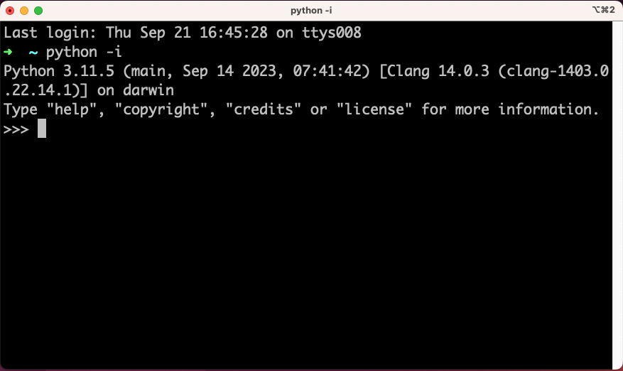

IDLE:n (Integrated Development and Learning Environment) on interaktiivinen prompt, joka muistaa yhden session ajan kaikki luomasi muuttujat, funktiot ja objektit. Sillä on vaikea kirjoittaa yhtä tai kahta riviä pidempiä funktioita, mutta ensimmäisten askeleiden ottamiseen se on täydellinen leikkikenttä.

Kunhan olet asentanut Pythonin sinun käyttöjärjestelmääsi soveltuvalla tavalla, aja alla näkyä komento shellissä, joka on käyttöjärjestelmästäsi riippuen esimerkiksi Git Bash.

```bash
$ python -i
```

Shelliin aukeaa uudenlainen prompt, jossa eivät enää toimi vanhat `ls` ja `pwd` komennot laisinkaan. Kyseessä on IDLE, joka ymmärtää Pythonia.



**Kuvio 1:** *IDLE käynnissä macOS:ssä. Mikäli sinulla on Windows, IDLE:n ympärillä näkyvä ikkuna on eri näköinen.*

Alla on esimerkkikoodia. Kokeile ajaa sama koodi IDLE:ssä itse. Huomaa, että jos kirjoitat pelkän muuttujan nimen, se tulostaa sen arvon (nimeltään `repr`, printable **repr**esentation). Vaihtoehtoisesti voit syöttää muuttujan sisäänrakennetulle `print`-funktiolle, joka tulostaa sen merkkijonona (`str`). Ero on pieni, mutta joissakin tapauksissa merkittävä.

```python
>>> kilometers = 60
>>> minutes = 20
>>> speed_km_minute = kilometers / minutes
>>> speed_km_minute
3.0
>>> speed_km_hour = speed_km_minutes * 60
>>> print(speed_km_hour)
180.0
>>> name = "Robin"
>>> message = f"{name} once drove {speed_km_hour} km/h \U0001F603"
>>> print(message)
Robin once drove 180.0 km/h 😃
```

Alla lisää harjoituksia. Harjoitukset ovat tyypillistä Pythonia, joten kommentit alkavat `#`-merkillä ja IDLE:stä tuttu `>>>` puuttuu rivin alusta.

```python
# Tehtävä 1: keskiarvo
a, b, c, d = 5, 5, 10, 10
average = _  
# Keksi, kuinka tämä lasketaan

# Tehtävä 2: muuttujan jyrääminen
a = 5
a = "Kissa"
print(a)
# Tutki, mitä tulostuu.

# Tehtävä 3: docstring
help(print)
# Katso, mitä help tekee. Pääset pois q-näppäintä painamalla.

# Tehtävä 4: nollalla jakaminen
result = 500 / 0   
# Tutki, mitä tapahtuu kun painat enteriä

# Tehtävä 5: f-string 
number = 42
print(f"{number:08b}")
# Pohdi, mitä tämä tekee.

# Tehtävä 6: sammuta IDLE
quit()   
# Tai näppäinyhdistelmä CTRL + D (EOF, End Of File)
```

