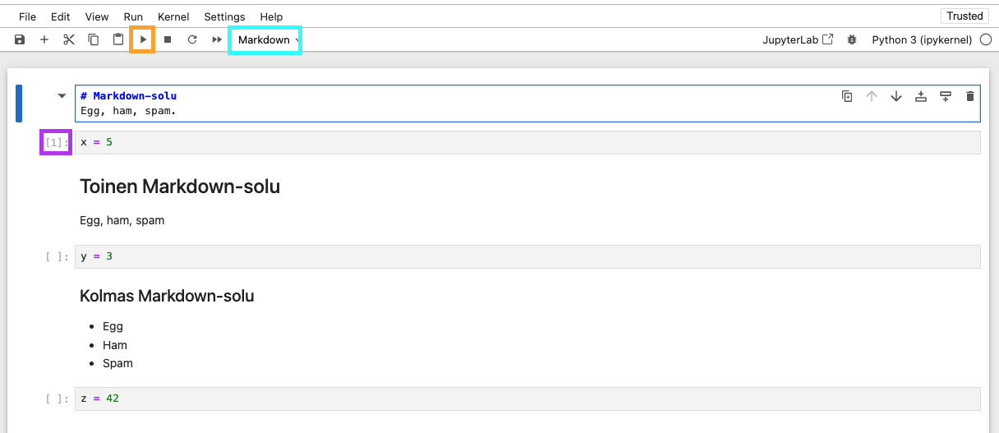

Koodia voi ajaa myös Jupyter Notebookissa, joka on web-selainpohjainen interaktiivinen IDE. Projektin voi asentaa joko käyttäen tuoreempaa `JupyterLab`:ia tai klassista `Jupyter Notebookia`. Notebook on hieman karsitumpi ominaisuuksiltaan, mutta sillä pärjää yllättävän pitkälle.

JupyterLabin hyötyjä ovat muun muassa:

- Välilehdet. Jupyter Notebook vaatii yhden selainikkunan per notebook. JupyterLabissa voit avata monta yhteen.
- Tiedostoselain.
- Tuki extensioneille (esim. [Jupyter Tabnine](https://github.com/codota/jupyter-tabnine))

Tiiviisti sanottuna: klassinen Jupyter Notebook, jos työskentelet yhden tiedoston koodin parissa.

!!! warning

    Ethän asenna Jupyter Notebookia järjestelmätason Pythoniin vaan virtuaaliympäristöön. Lue siis [pip](../asennus/paketinhallinta/pip.md)-luku ennen seuraavien komentojen ajamista!

Pidemmät asennusohjeet löytyvät [Jupyter:n dokumentaatiosta](https://jupyter.org/install), mutta alkuun pääsee kahdella seuraavalla komennolla:

```bash
# Ajathan komennot VIRTUAALIYMPÄRISTÖSSÄ
(.venv) $ pip install notebook
(.venv) $ jupyter notebook
```

Komento joko avaa suoraan selaimeesi Jupyter Notebook -näkymän, tai tarjoaa linkin, jota klikkaamalla pääset siihen. Ethän sulje terminaalia tai palvelin kuolee pois. Kun haluat lopettaa työskentelyn, varmista että tiedosto on tallennettu ++ctrl+s++ näppäinyhdistelmällä ja valitse Jupyter Notebookista `File => Shut Down`.

## Mitä ovat solut?

Yksittäinen solu (cell) on monirivinen tekstikenttä, joka voi sisältää joko koodia tai Markdown-tekstiä. Se, kumpaa solu sisältää, on käyttäjän päätettävissä.



**Kuvio 1:** _Jupyter Notebookin käyttöliittymä._

Yllä olevassa Kuvio 1:ssä näkyy Jupyter Notebookin käyttöliittymä. Alla muutama havainto:

- Kuvassa näkyy kuusi solua.
  - Ylin on sinisellä rajattu, aktiivinen Markdown-solu.
  - Turkoosi rajaus näyttää valinnan, jossa voi määritellä solun tyypin.
  - Alin on Python-solu, jossa lukee `z = 42`.
- Kolmesta koodisolusta vain yksi on ajettu. Tämän näkee violetilla neliöidystä järjestysnumerosta. Muuttujia `y` ja `z` ei siis ole vielä lisätty Python-kernelin muistiin.
- Keltainen rajaus osoittaa Play-nappulan, joka ajaa valitun solun. Tällä hetkellä se ajaisi aktiivisen Markdown-solun. Se ei sisällä koodia, mutta sen voi silti ajaa, jolloin sen muotoilu käännetään HTML:ksi.

!!! warning

    Tyypillisesti Python-skriptit (`jotain.py`) suoritetaan komennolla `python jotain.py`, ja tällöin tiedostot suoritetaan kokonaisuudessaan ylhäältä alas lukien, juuri siinä järjestyksessä. Jupyter Notebook poikkeaa tästä merkittävästi. Voit ajaa solut missä tahansa järjestyksessä ja niin monta kertaa kuin haluat.

    Python-kernel muistaa kaikki muuttuja-arvot: jopa sellaiset, joita ei enää näy missään, koska olet poistanut solun. Tämä vaatii tottumista, ja on sekä voima että kirous!

## Hyödyllisiä pikanäppäimiä

Jupyter Notebookia käytettäessä on hyvä tietää, että siinä on kaksi eri tilaa: **Command Mode** ja **Edit Mode**. Tässä mielessä se toimii samalla tavalla kuin pahamainen `vim`, joka on gitissä usein vakioeditori.

Tärkeimmät pikanäppäimet toimivat joka moodissa ja ne ovat ehdottomasti:

- ++shift+enter++. Se ajaa aktiivisen solun ja siirtyy seuraavaan soluun. Jos seuraavaa solua ei ole, se luodaan.
- ++ctrl+enter++ joka ajaa solun siirtymättä seuraavaan.
- ++ctrl+s++. Tallentaa.

Command Modessa toimivat pikanäppäimet.

| Pikanäppäin                       | Komento                                  |
| --------------------------------- | ---------------------------------------- |
| ++esc++                           | Poistuu Edit Modesta Command Modeen.     |
| ++y++                             | Vaihtaa solun koodiksi.                  |
| ++m++                             | Vaihtaa solun markdowniksi.              |
| ++a++                             | Lisää solun aktiivisen solun ylle        |
| ++b++                             | Lisää solun aktiivisen solun alle        |
| ++d+d++                           | Tuplaklikkaus. Poistaa aktiivisen solun. |
| ++up++, ++down++ tai ++j++, ++k++ | Selaa soluja ylös ja alas                |

Edit Modessa toimivat pikanäppäimet.

| Pikanäppäin | Komento                              |
| ----------- | ------------------------------------ |
| ++enter++   | Siirtyy Command Modesta Edit Modeen. |

Mikäli tarvitset muita pikanäppäimiä, ne löytyy `Help => Show Keyboard Shortcuts`.

!!! tip

    Jupyter Notebookin käytön oppii vain käyttämällä sitä! Kirjoita koodia eri soluihin ja kokeile, miten se toimii.
