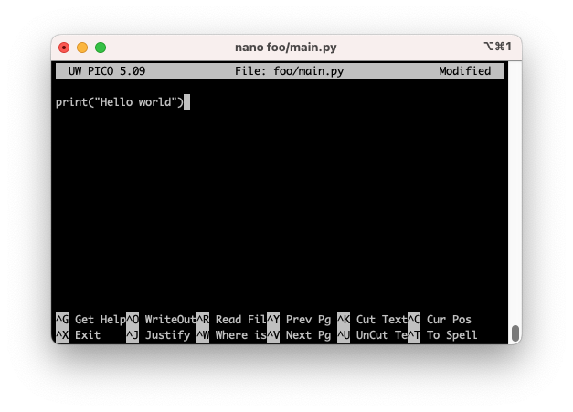

Nyt kun olet päässyt koodin suorittamiseen asti siten, että sinulla on olemassa pelkän IDLE:n sijasta tiedostoja, luothan projektille oman hakemiston, ja hakemiston sisään oman virtuaaliympäristön. Aktivoi virtuaaliympäristö aina kun ajat koodia.


## Kaikkien hakemistorakenteiden äiti

Tällä kurssilla suositeltu tapa organisoida koodi on seuraavanlainen, ja sitä suosittelee myös [Bryan Baum](https://www.bryanbraun.com/2017/08/29/how-i-organize-the-code-folder-on-my-computer/).

```
~/Code/<namespace>/<project-name>/
```

Alla sama selitettynä:

* **Code**-hakemisto kuuluu kotihakemistoosi (jota edustaa `~`-merkki). Jatkossa kirjoita **kaikki** koodi tämän hakemiston sisällä oleviin hakemistoihin.
* **Namespace**-tason hakemiston sisään kuuluvat kansiot, jotka edustavat Github- tai Gitlab-usernamea tai vastaavaa namespacea. 
    * Huomaa, että hakemiston nimi ei ole `<namespace>`. Tämä teksti kuuluu korvata namespacen arvolla ilman kulmasulkeita.
    * Lue lisää namespace-termistä [Gitlabin dokumentaatiosta](https://docs.gitlab.com/ee/user/namespace/). 
    * Mikäli luot väliaikaista tai kokeellista koodia, jota ei ole ikinä tarkoitus lisätä Gitlabin kaltaiseen palveluun, suosittelen käyttämään kansiota, joka edustaa pseudonamespace `private`.
* **Projekti**-tason hakemiston sisään tulee projekti juuri sillä `path`:lla, jolla lisäisit projektin Gitlab, Github, Bitbucket, DevOps, CodeCommit tai muuhun palveluun.
    * Huomaa, että projektin nimi ei ole `<project-name`, vaan kyseinen teksti kuuluu korvata oikealla projektin nimellä ilman kulmasulkeita.
    * Projektin polun kuuluu sisältää vain ja ainoastaan pieniä kirjaimia (`a-z`), tarpeen mukaan väliviivoja (`-`) ja äärimmäisessä hädässä myös numeroita (`0-9`).

Mikäli toimit näin, hakemistosi pysyvät järjestyksessä, ja järjestys täsmää käyttämäsi Git-servicen rakenteeseen. Alla selvyyden vuoksi pari kuviteltua linkkiä Githubiin tai Gitlabiin sekä niiden vastaavat kansiot.

```
# Käyttäjän alex projekti example-yrityksen Gitlabissa
https://gitlab.example.com/alex/my-project/
=> ~/Code/alex/my-project/

# Käyttäjän alexblack Gitlab Cloud projekti
https://gitlab.com/alexblack/public-project/
=> ~/Code/alexblack/public-project/

# Käyttäjän essiesimerkki Kamit Gitlab projekti
https://repo.kamit.fi/essiesimerkki/my-project/
=> ~/Code/essiesimerkki/my-project/

# Essi Esimerkki kuuluu ryhmään pythonistas
# Ja siinä ryhmässä hän osallistuu ryhmätyöhön megaproject
https://repo.kamit.fi/pythonistas/megaproject/
=> ~/Code/pythonistas/megaproject/

# Käyttäjän sourander projekti python-perusteet (eli tämä tässä)
https://github.com/sourander/python-perusteet
=> ~/Code/sourander/python-perusteet/
```

Esimerkiksi opettaja Jani Souranderin `~/Code/`-kansion sisältö voisi näyttää tältä:

```
.
├── jsourand1                 # Kamit Gitlab-tunnus
│   ├── repo-manager
│   └── how-to-git
├── jsourand1                 # DC Labran Gitlab-tunnus
│   └── parrot
├── private                   # Yksityisiä testiprojekteja
│   └── foobar
├── pythonistas               # Ehkä myös minä olen pythonistas-ryhmässä
│   └── megaproject
└── sourander                 # Julkinen Github/Gitlab tunnus
    ├── linux-perusteet
    ├── python-perusteet
    └── python-perusteet-code
```


## Tee ensimmäinen projekti

!!! tip
    Sanan `foobar` ja siihen liittyvien `foo`, `bar` ja `baz` sanojen käyttö esimerkeissä ja testiprojekteissa on yleinen koventio ohjelmistonkehittäjien piirissä, hieman samalla tavalla kuin kirjoitetun tekstin korvaana olevan `lorem ipsum`, joka on latinaa muistuttavaa, täysin merkityksetöntä tekstiä. Tutustu aiheeseen esimerkiksi [Foobar wikipedia](https://en.wikipedia.org/wiki/Foobar)-sivulla.

Luo ensimmäinen projekti ja sille oma virtuaaliympäristö. Luomamme projekti on väliaikainen eikä sitä aiota säilöä ikinä gittiin, joten `~/Code/private/` on sille sopiva lokaatio. Avaa Git Bash ja aja seuraavat komennot.

```bash
# Parametri -p luo hakemistot (rekursiivisesti), 
# oli niitä olemassa tai ei.
$ mkdir -p ~/Code/private/foobar

# Siirry äsken luotuun hakemistoon
$ cd ~/Code/private/foobar

# Luo Pythonilla virtuaaliympäristö
$ python -m venv .venv

# Luo projektikansio
$ mkdir foo

# Luo projektikansioon tiedostoja
$ touch foo/main.py
$ touch foo/__init__.py

# Aktivoi virtuaaliympäristö
$ source .venv/Scripts/activate  # <= Windows
$ source .venv/bin/activate      # <= macOS ja Linux
```

Nyt sinulla on hakemistorakenne luotuna. Varmista, että hakemisto sisältää oikeat tiedostot. Jos et muuten ole varma, käy hakemistossa esimerkiksi Windowsin File Explorerilla. Hakemiston sisällön pitäisi olla seuraava:

```bash
.
├── .venv    # .venv on hakemisto
└── foo
    ├── __init__.py
    └── main.py
```


## Ensimmäinen rivi koodia

Nyt on aika luoda koodia. Ennen kuin siirrytään käyttämään Visual Studio Codea, kokeillaan luoda koodia ilman sitä. Git Bashissä, useimmissa Linux-distribuutioissa ja macOS:ssä on kaikissa tekstieditori nimeltään `nano`, joka muistuttaa läheisesti tyypillistä Notepadiä, mutta sillä ei ole graafista käyttöliittymää. Käytetään sitä.

```bash
$ nano foo/main.py
```



**Kuvio 1**: *Nano macOS:ssä avattuna. Tekstieditorissa on auki tiedosto `main.py`.*

Kirjoita tiedoston sisään yksinkertainen, yksin rivin koodi. Huomaa, että voit kirjoittaa lainausmerkkien väliin minkä tahansa viestin, minkä haluat ohjelman tulostavan. Tässä esitelty hello world on ohjelmistokielen käyttöönottoon liittyvä konventio, jossa tietokone laitetaan tervehtimään maailmaa ikään kuin uudesti maailmaan syntyneenä. Kirjoita `nano`-ohjelmsassa tiedostoon seuraava sisältö:

```python
print("Hello world")  # <= Voit korvata viestin haluamallasi tekstillä.
```

Ohjelma ei käytä samoja pikanäppäimiä kuin tyypilliset Windows-sovellukset, joten painele näppäimiä summamutikassa. Lue sen sijaan ruudun alalaidas ohjeet. Tarvitset näistä kahta komentoa:

* ++ctrl+o++ kirjoittaa tiedoston (eli "tallentaa" sen tiedostoon).
* ++ctrl+x++ poistuu ohjelmasta.

Nyt voit suorittaa kirjoittamasi koodin Python-tulkilla. Tämä onnistuu seuraavalla komennolla:

```bash
# Vaihtoehto 1: Ajetaan tiedostona
$ python foo/main.py
Hello world

# Vaihtoehto 2: Ajetaan moduulina
$ python -m foo.main
Hello world

# Vaihtoehto 3: Syötetään ajettava koodi argumentin -c arvona
$ python -c "import foo.main"
Hello world
```

Huomaa, että moduuli `main` kuuluu pakettiin `foo`. Olet jo aiemminkin ajanut Pythonissa moduuleita. Aiemmin ajettu `python -m venv` suoritti moduulin nimeltään `venv`. Kyseinen moduuli on, aivan kuten kaikki muukin Pythonin ajama koodi, jossakin tiedostossa. Voit selvittää tiedoston sijainnin näin:

```bash
$ python -c "import venv; print(venv.__file__)"
/Users/opettaja/.pyenv/versions/3.11.5/lib/python3.11/venv/__init__.py
```

Python on avointa lähdekoodia, ja kyseisen moduulin koodi löytyy Githubista [python/cpython/Lib/venv/](https://github.com/python/cpython/tree/main/Lib/venv).

!!! question "Tehtävä"
    Yllä mainitaan CPython. Selvitä, mikä CPython oikeastaan on. Vinkki: vaihtoehtoja ovat muiden muassa Jython, Pypy.


## Visual Studio Code

Avataan sama projekti Visual Studio Codessa. Tämän pitäisi onnistua seuraavalla komennolla Git Bashissä:

```bash
$ pwd      # Varmista, että olet oikeassa hakemistossa
~/Code/private/foobar

$ code .   # Käynnistä nykyinen hakemisto Codessa.
```

Vaihtoehtoisesti voit käynnistää Visual Studio Coden käsin ja valita `File => Open Folder`, etsiä nykyisen projektikansion `foobar`, ja painaa `Open`.


!!! question "Tehtävä"
    Nyt osaat luoda `.py`-päätteisen skriptin ja ajaa sen. Kokeile copy-pastettaa [Syntaksi](syntaksi.md)-sivun koodia otsiskon "Välteltävät avainsanat" alta. Muokkaa koodia siten, että ruutuun tulostuvat nimenomaan ne builtinit, jotka **eivät** ala pienellä kirjaimella, vaan **millä tahansa paitsi** pienellä kirjaimella. Huomaathan, että sinun tarvitsee kopioida myös funktion määritelmä samaan tiedostoon. Vihje tehtävään: `not`.