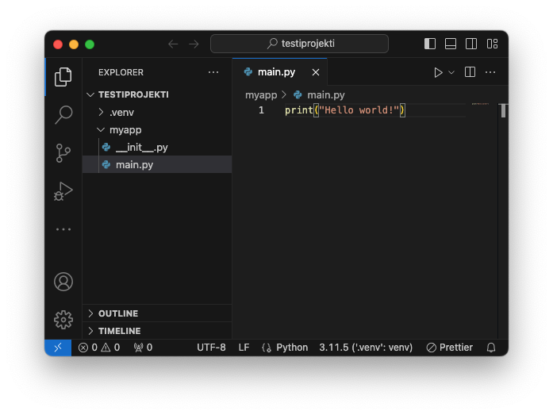

## Mikä ihmeen pip?

PIP (Preferred Installer Program) on työkalu, jolla voi asentaa kirjastoja muun muassa PyPi:stä (Python Package Index). Merkittävä osa Pythonin hyödyllisyydestä perustuu kattavaan PyPi:n kirjastoon ja muuhun Python-yhteisön luomaan sisältöön kuten tutoriaaleihin. Kunhan sinulla on pip asennettuna oikein, voit asentaa (mielellään virtuaaliympäristöön!) tarvitsemasi kirjastot. Alla kaksi esimerkkiä:

```bash
# Tämä asentaisi Amazon Web Services SDK:n, jolla voit muun muassa
# pystyttää virtuaalikoneita AWS:ään.
$ pip install boto3

# Tämä asentaisi Jupyter Notebookin, joka on verkkoselainpohjainen,
# interaktiivinen koodinkehitysympäristö.
$ pip install notebook
```

Lopulta, kun olet luonut ensimmäisen projektisi ja haluat jakaa sen muiden kanssa, voit tehdä omasta projektistasi pip-asennettavan paketin setuptools:n avulla. Tarvitset vain `setup.py`-tiedoston. Tähän aiheeseen kannattaa tutustua hieman myöhemmin, kun olet sinut pip:n kanssa.

Kaikki asennetut paketit voit listata komennolla freeze:

```bash
$ pip freeze
# tulostaa rivejä, esim:
# certifi==2023.7.22
```


!!! warning
    Ethän siis asenna `pip`:llä paketteja, ellei sinulla ole virtuaaliympäristö aktivoituna.

## Mikä ihmeen venv?

Tässä ohjeessa neuvotaan asentamaan pip:llä paketit **virtuaaliympäristöön**. Projektikohtaisen virtuaaliympäristön luominen Pythonissa on helppoa, ja onnistuu tyypillisesti yhdellä komennolla. Kuvitellaan, että olet kansiossa `~/Code/munnimi/my-project/` ja ajat komennon `tree -a -L 2`, joka piirtää hakemiston sisällön ASCII-puuna terminaaliin. Kansio voisi näyttää muun muassa seuraavalta:

```bash
.
├── .git
├── my_project
│   ├── __init__.py
│   └── main.py
└── .venv          # <= Tämä kansio sisältää virtuaaliympäristön
    ├── bin
    ├── include
    ├── lib
    ├── lib64 -> lib
    └── pyvenv.cfg

```

Virtuaaliympäristö ei ole välttämättä nimeltään `.venv`, mutta tätä käytäntöä noudetetaan tällä kurssilla. Virtuaaliympäristön ei myöskään ole pakko olla projektikansion sisällä, vaan sen voisi sijoittaa muualle tiedostojärjestelmään. Mikäli haaveissa on käyttää yhtä virtuaaliympäristöä eri projekteissa, kannattaa tutustua venv-moduulin ja pip:n lisäksi muihin työkaluihin, kuten pipx sekä virtualenv ja pyenv-virtualenv. Jos käytät Pythonia ensimmäistä kertaa, kannattaa ympäristö koittaa pitää yksinkertaisena, ja suosia Pythonin omaa venv-moduulia.

Virtuaaliympäristön tuoma hyöty on se, että kun asennat projektiisi joitakin kirjastoja (komennolla `pip install <jokin-paketti>`), et sotke tähän koko järjestelmän laajuista Pythonia, vaan nämä kirjastot asennetaan **tämän projektikansion sisään**. Unix-pohjaisissa käyttöjärjestelmissä relatiivinen polku on esimerkiksi: `.venv/lib/python3.11/site-packages/`.

??? tip "Symbolic links"
    Komento `python -venv <kansionnimi>` kopioi tai luo symbolisen linkin Python executableen, jolla kyseinen komento ajettiin. Se, onko kyseessä defaulttina kopio vai symbolinen linkki, riippuu käyttöjärjestelmässä. 
    
    Windowsissa tiedostot kopioidaan fyysisesti `.venv/Scripts`-kansion alaisuuteen, mukaan lukien `python.exe`. Unix-pohjaissa käyttöjärjestelmissä default on käyttää symbolista linkkiä, jolloin tiedosto `.venv/bin/python` viittaa esimerkiksi tiedostoon `/usr/bin/python3` tai `~/.pyenv/versions/3.11.5/bin/python`. Mikäli poistat tämän virtuaaliympäristön hyödyntämän Pythonin, se virtuaaliympäristö lakkaa toimimasta. Mikäli virtuaaliympäristö viittaa järjestelmätason Pythoniin (eli `/usr/bin/`), on myös mahdollista että käyttöjärjestelmäpäivitys tai paketinhallinnan `update`-komento päivittää Pythonin tuoreempaan versioon, jolloin myös virtuaaliympäristösi versio päivittyy.
    
    Mikäli haluat Unix-pohjaisissa käyttöjärjestelmissä varmistaa, että Python **kopioidaan** kyseiseen kansioon, tarvitsee sinun ajaa venv-moduuli lisäparametrilla, näin:
    
    ```bash
    $ python -m venv --copies .venv
    ```
    
    Parempi ratkaisu on kuitenkin käyttää pyenv:iä ja olla poistamatta vanhoja Python-versioita.


!!! warning
    Huomaathan, että virtuaaliympäristö tulee aktivoida **aina uudestaan** kun käynnistät uuden Git Bash -ikkunan, tai sammutat ja käynnistät tietokoneen uudestaan, tai muutoin päädyt kansioon siten, että ympäristö on vaihtunut. Kyseessä ei siis ole millään tavoin istunnosta toiseen pysyvä asetus!

## Asennus ja käyttö: Windows

!!! warning
    Huomaa, että Git Bash emuloi Linux-maailmasta tuttua Bash-shelliä. Tämän takia esimerkiksi hakemistojen välissä käytetty erotin on ajoittain komentojen tuloisteissa POSIX- eli Linux-suuntaan (`/`) ja ajoittain Windows-suuntaan (`\`). Git Bash on outo sekoitus Windowsia ja Linuxia: sen kanssa pitää vain oppia tulemaan toimeen, mikäli käyttää Windowsia kehitysympäristönä. Merkki `~` eli tilde eli aalto viittaa käyttäjän kotihakemistoon.

Windowsissa pip asentuu Pythonin mukana. Se asentuu lokaatioon `$LOCALAPPDATA/Programs/Python/Python311/Scripts/pip.exe`. Komento ei välttämättä ole $PATH:ssa eikä sitä täten voi ajaa suoraan komentokehotteesta, mutta tällä ei ole väliä. Meille riittää, että komento toimii virtuaaliympäristöissä.

!!! tip
    Lukuohje ympäristömuuttujiin. Bashissä, kuten myös Windowsissa, on olemassa ympäristömuuttujia. Linuxissa näihin viitataan syntaksilla `$MUUTTUJA` ja Windowsissa `%MUUTTUJA%`. Osa näistä on aina olemassa, kuten `$PATH`, joka sisältää puolipisteellä erotellun listan hakemistoista, joista ajettavia komentoja etsitään. Tutustu olemassa oleviin ympäristömuuttujiin ajamalla Git Bash:ssä komento `printenv`. Niitä on huomattavan paljon. Käytän paria näistä alla olevissa komennoissa lyhentämään muutoin kammottavan pitkiä tiedosto- tai hakemistopolkuja.

Avaa Git Bash ja siirry johonkin kansioon, jossa uskallat kokeilla virtuaaliympäristöjä.

```bash
# Mene hakemistoon, jota haluat testata pip-hallittuna projektina
# Alla esimerkki
$ mkdir -p ~/Code/<kirjoita-gitlab-tunnuksesi>/testiprojekti/
$ cd ~/Code/<kirjoita-gitlab-tunnuksesi>/testiprojekti/

# Jos yllä oleva python.exe löytyy AppData kansion alta, niin jatka ohjetta.
# Luo virtuaaliympäristö hakemistoon .venv
# Syntyvä hakemisto on siis: .../testiprojekti/.venv/
$ python -m venv .venv

# PS. Lue lisää python executablen optionseista täällä:
# https://docs.python.org/3/using/cmdline.html

# Aktivoi virtuaaliympäristö
source .venv/Scripts/activate

# Virtuaaliympäristö on aktivoitu jos komentokehotteen rivi alkaa `(.venv)`-tekstillä.
# Tämä ei valitettavasti aina toimi Git Bash:ssä, vaan se saattaa tulostua oudosti vasta
# seuraavalle riville.
(.venv) $

# Varmista vielä, että ensimmäinen Python listalla on nimenomaan projektin alla oleva 
# paikallinen python.exe eli virtuaaliympäristö.
$ py -0p
  *               $PWD\.venv\Scripts\python.exe
 -V:3.11          %LOCALAPPDATA\Programs\Python\Python311\python.exe

# Näin voit deaktivoida virtuaaliympäristön
$ deactivate

# Mikäli vahingossa deaktivoit virtuaaliympäristön, aktivoi se uusiksi komennolla 
# source .venv/Scripts/activate
```

## Asennus ja käyttö: macOS

Mikäli noudatit Pythonin asennusohjetta ja sinulle on Homebrew:lla asennettu pyenv, pip on asennettuna ja toimii suoraan. Muutoin `pip`:n käyttö on lähes identtistä Windowsin kanssa, pois lukien se, että `py.exe`-ohjelmaa ei ole olemassa ja `activate`-skriptin sijainti on eri. Aiemmin asentamasi `pyenv` hoitaa tuon ohjelman tehtävät - ja paljon muuta!

```bash
# Mene hakemistoon, jota haluat testata pip-hallittuna projektina
$ mkdir -p ~/Code/<kirjoita-gitlab-tunnuksesi>/testiprojekti/
$ cd ~/Code/<kirjoita-gitlab-tunnuksesi>/testiprojekti/

# Luo virtuaaliympäristö hakemistoon $PWD/.venv/
$ python -m venv --copies .venv

# Aktivoi virtuaaliympäristö
$ source .venv/bin/activate

# Tarkista, mikä Python on käytössä
(.venv) $ which python
$PWD/.venv/bin/python

# Näin voit deaktivoida virtuaaliympäristön
$ deactivate
```

## Asennus: Linux

Mikäli käytät Linux-distribuution mukana tullutta Pythonia, sinulta puuttuu todennäköisesti joitakin riippuvuuksia. Nämä, joihin lukeutunee todennäköisesti ainakin `python3-pip`, tulostetaan ruudulle kun yrität luoda virtuaaliympäristöä komennolla `python -m venv .venv`. Noudata ohjeita ja asenna ne.

Mikäli asensin pyenv:n aiemmin esiteltyjen ohjeiden mukaisesti, voit noudattaa tismalleen samoja ohjeita kuin yllä macOS:n kohdalla.


## Käyttö: Visual Studio Code

Virtuaaliympäristö tulee ottaa käyttöön aina, kun ajat projektisi koodia tai asennat siihen kirjastoja `pip`:llä. Tähän "aina"-tilanteeseen luetaan myös IDE:t kuten Visual Studio Code.

Kun haluat muokata projektisi koodia Codessa, **älä avaa yksittäisiä tiedostoja vaan koko hakemisto (eli kansio)** Codessa. Tämä onnistuu muun muassa seuraavin keinoin:

**Ensimmäinen keino**: kun olet Git Bashissä (tai käyttöjärjestelmäsi mukaisessa shellissä) projektikansiossa, joka on tämän esimerkin kohdalla `~/Code/username/testiprojekti`, kirjoita `code .` komentoriville ja paina enter. Code viittaa Visual Studio Codeen, ja piste viittaa nykyiseen hakemistoon. Komento on siis "Visual Studio Code, plz avaa tämä hakemisto."

**Toinen keino:** avaa Visual Studio Code käynnistysmenusta tai muusta pikakuvakkeesta. Valitse vasemmalta yltäältä `File => Open Folder`. Navigoi kansionäkymässä oikeaan hakemistoon ja paina Open.

Kun projektin hakemisto on avattuna, vasemman laidan Explorerissa pitäisi näkyä otsikkona kyseisen kansion nimi. Katso Kuvio 1.



**Kuvio 1**: *Virtuaaliympäristö (tai mikä tahansa muu valittu Python-tulkki) näkyy Visual Studio Coden ikkunan oikeassa alalaidassa silloin kun sinulla on Python-tiedosto avattuna ja aktiivisena. Mikäli olet luonut virtuaaliympäristön ennen Coden avaamista, löytää Code sen usein automaattisesti.*

Mikäli Visual Studio Code ei näytä mitään Python-tulkkia oikeassa alalaidassa, varmista, että sinulla on jokin `.py`-päätteinen tiedosto avattuna, kuten Kuviossa 1 näkyy (`myapp/main.py`).Seuraavaksi varmista, että onhan virtuaaliympäristö varmasti sinun projektikansiossasi. Yllä olevan Kuvio 1:n tapauksessa kansiot ovat:

```
# Projektikansio
~/Code/username/testiprojekti    # <= Tämä on avattu Codeen kansiona

# Virtuaaliympäristä
~/Code/username/testiprojekti/.venv

# Koodia sisältävä moduuli
~/Code/username/testiprojekti/myapp/
```


## Vahingossa asennettujen kirjastojen poisto

Mikäli vahingossa ajat esimerkiksi komennon `pip install notebook` käsin asentamaasi Python-versioon, pip asentaa siihen aivan valtavan määrän riippuvuuksia, jotka eivät valitettavasti poistu `pip uninstall notebook`-komennolla. 

```bash
$ pip uninstall -y  $(pip freeze | cut -d"=" -f1)
```

!!! warning
    Ethän poista Linuxissa tai macOS:ssä järjestelmätason Pythonista (eli `/usr/bin/python3`) riippuvuuksia!
