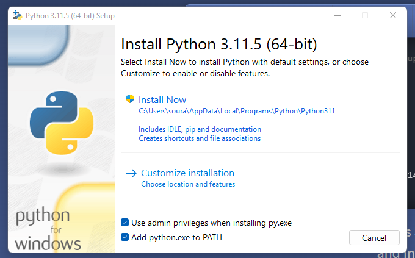

## Git for Windows

Jotta sinulla olisi Git asennettuna oikein, asenna Git for Windows, mikäli sinulla ei ole sitä vielä asennettuna. Voit ladata sen [Git for Windows](https://gitforwindows.org/) -sivustolta. Asenna se ja käynnistä kone uusiksi.

## Python

Mene [Python.org](https://www.python.org/) sivustolle ja lataa etusivulla mainostettu tuorein Python 3 versio (esim. `3.11.5`).



**Kuvio 1:** *Pythonin asennusohjelma. Huomaa ruudun alalaidassa oleva Add python.exe to PATH. Sen ruksin pitää olla aktiivisena.*

!!! warning

    TÄRKEÄÄ! Kun asenna Pythonia, asennus kysyy, lisätäänkö Python PATH:iin. Salli se.

!!! tip

    Koodisnippettien lukuohje. Ajettava komento alkaa aina `$`-merkillä, aivan kuten Git Bash:n promt itsessään. Mikäli rivi alkaa `#`-merkillä, rivi on ohjeistuksena toimiva kommentti. Muissa tapauksissa kyseessä on tuloste, joka syntyy kun painat komennon jälkeen enteriä. Irrallisten komentojen väliin on lisätty tyhjä rivi parantamaan luettavuutta.

Käynnistä Git Bash ja suorita seuraava komento:

```bash
# Varmista että python executable löytyy ja viittaa oikeaan versioon
# Ensimmäisen itemin PATH:ssa pitäisi olla Python 3.X:n executable.
$ py -0p
 -V:3.11 *        $LOCALAPPDATA\Programs\Python\Python311\python.exe

$ python --version
Python 3.11.5
```

Mikäli `py.exe` löysi onnistuneesti asentamasi Pythonin, ja `python --version` palauttaa asentamasi version versionumeron, Python on onnistuneesti asennettu ja lisätty $PATH:iin. 

## Ongelmien ratkaiseminen

Mikäli yllä komennot eivät toimi, tarkista oikeiskirjoitus, ja että asensit Pythonin siten että se lisätään PATH:iin. Tämän voit tarkistaa ajamalla seuraavan komennon Git Bash:ssä:

```bash
$ echo $PATH | tr ":" "\n" | grep -i python
/c/Users/username/AppData/Local/Programs/Python/Python310  # <= Tällainen rivi pitäisi löytyä
```

Mikäli vastaavaa riviä ei löydy $PATH:sta, lisää se. Tähän löytyy netistä useita ohjeita, kuten tämä: [Real Python: Add Python to PATH](https://realpython.com/add-python-to-path/). Mikäli polku löytyy $PATH-muuttujasta mutta ei ohjeen osoittamasta paikasta eli Control Panelista, voi olla että se on lisättynä Windowsin rekisteriin. Windowsin rekisteriin puuttumisen suhteen kannattaa olla to-del-la varovainen. Rekisteriä pääsee muokkaamaan etsimällä Windows-näppäimen avulla App nimeltään Registry Editor. PATH löytyy paikasta `Computer\HKEY_LOCAL_MACHINE\SYSTEM\CurrentControlSet\Control\Session Manager\Environment`, muuttujasta nimeltään Path.