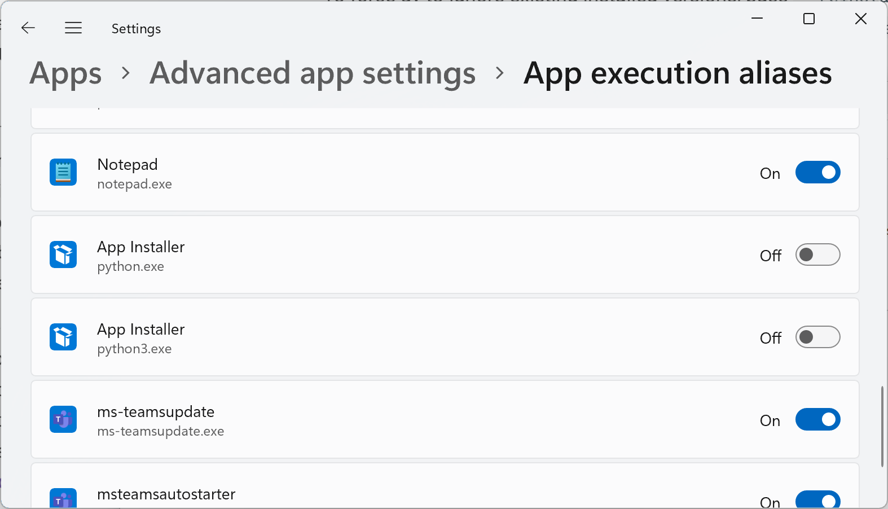

!!! info

    Huomaa, että Pythonin voi asentaa myös muilla tavoin, kuten lataamalla sen suoraan Python.org-sivustolta. Minun kurssilla suositeltu tapa on kuitenkin käyttää `uv`-työkalua, joka käytännössä korvaa `pyenv`, `poetry`, `pip` työkalut. Lisäksi mukana asentuva `uvx` korvaa `pipx`-työkalun.

## Python-aliaksen poistaminen



**Kuvio 1:** *Poista Python-aliakset, jotta Windows ei vahingossataan tarjota Storesta Pythonia.*

Vakiona Windows tarjoaa PATH:iin polun, joka ohjaa `python`-käskyn Windows Storeen. Tämä on meidän käytössä täysin turha; voit kytkeä sen pois päältä Windowsin asetuksista. Avaa Windowsin asetukset (++win+x++ ja valitse Settings) ja navigoi kohtaan "Apps" -> "Advanced App Settings" -> "App execution aliases". Kytke ruutukaappauksessa (ks. Kuvio 1) näkyvät asetukset pois päältä.

!!! tip "Vaihtoehtoiset askeleet"

    Mikäli haluat tai koet tarpeelliseksi, voit poistaa kaikki Python-asennukset, jotka "Add or remove programs" -valikossa näkyvät. Tämä ei ole suinkaan pakollista, ja `uv` hallitsee itse asentamansa Pythonit, mutta tämä voi vapauttaa tilaa ja vähentää yleistä versiosekaannusta.

## uv:n asennus

Tarkista tuorein ohje [uv: installing uv](https://docs.astral.sh/uv/getting-started/installation/) ohjeista. Mikäli se on sama kuin tätä kirjoittaessa, niin avaa uusi PowerShell-ikkuna ja aja seuraava komento:

```bash
powershell -ExecutionPolicy ByPass -c "irm https://astral.sh/uv/install.ps1 | iex"
```

## Autocompletion

Jos käytät Git Bashiä sinun shellinä, kuten KAMK:ssa useimmilla kursseilla neuvotaan, niin voit ottaa käyttöön autocompletionin. Tämä helpottaa komentojen kirjoittamista, kun voit painaa `Tab`-näppäintä ja shelli täydentää komennon puolestasi. Tämä onnistuu ajamalla seuraavat komennot:

```bash
# Lisää uv autocompletion
echo 'eval "$(uv generate-shell-completion bash)"' >> ~/.bashrc

# Lisää uvx autocompletion
echo 'eval "$(uvx --generate-shell-completion bash)"' >> ~/.bashrc
```

!!! tip

    Uv-työkalun käyttö neuvotaan [Ajaminen/uv](../ajaminen/uv.md) -sivulla.
