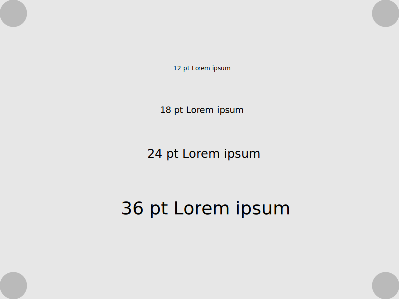
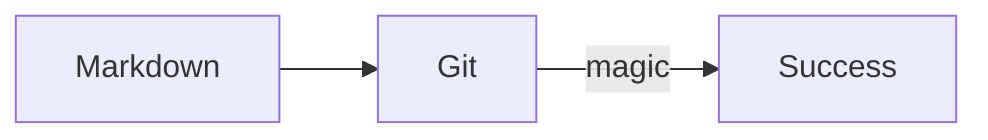

# Extensions How-To

Below, you can see a demonstration of all extensions that have been activated in the default `mkdocs.yml` file.

## Syntax highlighting

The code block also demonstrates the copy code, annotation, mark text and keyboard keys functionalities

```python
import os

a = os.name + '-' + 'cat' # (1)
print(a)
```

1.  :cat: I'm a code annotation! I can contain `code`, __formatted
    text__, images, ... basically anything that can be written in Markdown.

Clicking the ==Copy to clipboard== saves you from a tedious ++ctrl+c++ process.

:book: The syntax highlighting supports all languages supported py Pygments. The full list is available [in Pygments docs](https://pygments.org/languages/)

# Admonitions

!!! tip
    You can add longers tips inside their own container blocks using `!!! tip "Headline"`, including an optional headline.

!!! question "Exercise: Do it"
    Exercise: It must be done.

??? note
    You can add longers tips inside their own container blocks using `??? <admonition>`.

!!! quote
    The way to get started is to quit talking and begin doing. *--Walt Disney*

# Emoji

Prefer these standard usages for emojis:

| Visual        | Code            | Usage         | Alt. admonition         |
|--------------:|-----------------|---------------| ----------------------- |
| :fire:        | `:fire:`        | Short tip     | tip                     |
| :question:    | `:pushpin:`     | Exercise      | question                |
| :exclamation: | `:exclamation:` | Important     | N/A                     |
| :exclamation: | `:exclamation:` | Important     | Long, off the map note. |
| :book:        | `:book:`        | Read more     | quote                   |

 :book: The list of Unicode emoji shortnames can be found at [Emojipedia](https://emojipedia.org/twitter/). 

# Images

Use relative path to images. Prefer SVG when possible. The image below is 800x600 SVG and has a solid color rectangle as a background to make sure any text is visible in day/night mode. The color of the background is `HSL(0,0,90)` in Affinity Designer which results to `rgb(231,231,231)`.Created by having "Force Pixel Alignment" activated in Affinity Designer and exported using preset: `SVG (for export)`.


**Figure 1**: *Beautiful corner blobs with lots of negative space. Meaningful text in the middle. Absolutely splendid artwork.*

This is an example paragraph showing how the text flows after a caption. Lorem ipsum dolor sit amet, consectetur adipiscing elit. Duis eget arcu sed elit euismod fermentum eu a sem. Cras eu imperdiet urna. Praesent pulvinar metus ac justo faucibus, vel elementum ligula hendrerit. Lorem ipsum dolor sit amet, consectetur adipiscing elit. Praesent ut ex libero. Integer mollis turpis porta ligula tempus, quis sodales dolor placerat. Praesent non diam vestibulum, dictum risus vel, tincidunt magna.

# Mermaid Graphs



:book: Check more at [Mermaid Tutorials](https://mermaid.js.org/config/Tutorials.html)