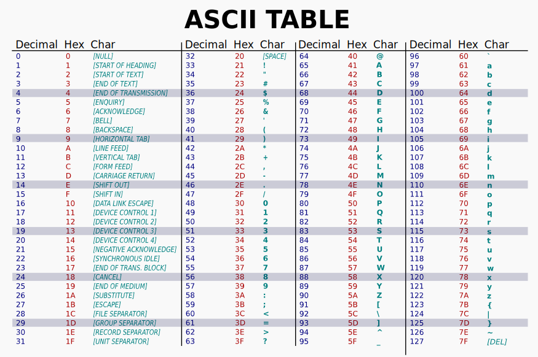

Pythonissa merkkijono (eng. `string`) on muuttumaton (eng. `immutable`) sarja Unicode-koodipisteitä. Tutkitaan, mitä äskeinen lause tarkoittaa. Alla olevassa snippetissä luodaan merkkijono `"Hello world! 😀"`, joka sijoitetaan muuttujaan nimeltään `message`. Lopulta muuttujan arvo tulostetaan ruudulle (tai standarditulosteeseen.)

```python
message = "Hello world! 😀"
print(message)
```


## Merkkijonon luonti

Literaalin merkkijonon voi luoda kirjoittamalla jotakin lainausmerkkien väliin tai heittomerkkien väliin. Seuraavat komennot toimivat REPL:ssä:

```python
>>> 'Cat'
'Cat'
>>> "Cat"
'Cat'
>>> print("Cat")
Cat
```

Tyypillisesti merkkijono sijoitetaan muuttujaan, jotta sitä voi käyttää myöhemmin. Alla oleva koodi on ajettu REPL:ssä:

```python
>>> animal = "Cat"
>>> print(animal)
Cat
```

Voit luoda myös muista muuttujatyypeistä merkkijonona ja syötämällä ne `str`-konstruktorille argumenttina. Tämä toimii kaikkiin objekteihin, ellei objektista ole tarkoituksella poistettu tätä toiminnallisuutta (eli metodia `__str__`). Alla esimerkkejä:

```python
>>> str(4)    # Kokonaisluku (int)
'4'
>>> str(4.0)  # Desimaaliluku (float)
'4.0'
>>> str(str)  # Luokka string itsessään
"<class 'str'>"
```

Tyypillisesti koodi kannattaa kirjoittaa siten, että käytät yhtä tyyliä läpi koodin. Valitse siis joko lainausmerkit `"Kissa"` tai heittomerkit `'Kissa'`. Mikäli tarvitset lainausmerkkiä ja/tai heittomerkkiä merkkijonon sisällä, sinulla on pari vaihtoehtoa.

```python
# Vaihtoehto 1: käytä vastakkaisia merkkejä
incl_apostrophe = "A scratch? Your arm's off!"
incl_quotes = 'A "scratch"? Your arm is off!'

# Vaihtoehto 2: Käytä backslashiä karkaamaan seuraava merkki
incl_both = "A \"scratch\"? Your arm's off!"

# Vaihtoehto 3: Käytä Unicode code pointtia
incl_both = "A \x22scratch\x22? Your arm's off!"
```

Vaihtoehto kolme on vaikealukuinen ja saattaa herättää kysymyksiä. Kenoviiva (eng. backslash) on Pythonissa, kuten myös monissa muissakin kielissä, tietynlainen metamerkki, jonka merkitys on `escape character`. Kenoviivaa seuraaville merkeille annetaan erityismerkitys. Alla muutama:

| Escape | Merkitys                                                |
| ------ | ------------------------------------------------------- |
| `\n`   | Uusi rivi. ("Line Feed")                                |
| `\r`   | Siirrä kirjoituskoneen vaunu alkuun ("Carriage return") |
| `\t`   | Tabulaattori eli sarkain                                |
| `\b`   | Askelpalautin eli backspace                             |

Kokeile ihmeessä, kuinka nykyajan tietokone reagoi käskyyn, jossa pyydät palauttamaan kirjoituskoneen vaunun alkuasentoonsa. Tai kuinka se reagoi, jos sijoitat keskelle merkkijonoa askelpalauttimia? Entäpä uudet rivit? Selvitä, mitä seuraavat komennot tulostavat.

```python
print("This is a sentence that will be partially \r Overwritten")
print("This is a sentence that will be partially \b\b\b\b\b Overwritten") # (1)
print("This \n is \n awesome")
```

1. Huomaathan, että `\b`toimii REPL:ssä, mutta ei Jupyter Notebookissa.

Entä, jos sinulla on tarve käyttää kenoviivaa merkkijonossa? Tämän ongelman voit ratkaista pakenemalla kenoviivan itsensä tai :

```python
# Vaihtoehto 1: pakene kenoviiva
>>> print("C:\\Users\\")
C:\Users\

# Vaihtoehto 2: Käytä raw stringiä muodolla r"".
>>> print(r"C:\Users\")
```

Jos sinulla on tarve muodostaa todella pitkä merkkijono, sinulla on muutamia vaihtoehtoja.

```python
# Vaihtoehto 1: Sijoita merkkijono kolmen lainausmerkin tai heittomerkin väliin
long_string = """You can write the string between triple-quotation
marks and it will preserve all the formatting including
        <= this unnecessary whitespace. End the following newline character.
"""

# Vaihtoehto 2: Sijoita merkkijono osina sulkujen sisään
long_string = (
    "This is a very long string "
    "written on multiple lines "
    "but printed on a single line "
    "since there are no newline characters."
)

# Vaihtoehto 3: Yhdistämä list<str> tyypin muuttujan entiteetit
list_of_strings = [ 
    "This is a very long string",
    "written in multiple list items",
    "but printed on a single line",
    "since there are no newline characters.",
]
long_string = " ".join(list_of_strings)
```


## Merkkijono ja operaattorit

Merkkijonot eivät ole lukuja, mutta valitut Pythonin aritmeettiset operaatiot, vertailuoperaattorit, loogiset operaattorit sekä jäsenyyttä testaavat operaattorit toimivat niitä vasten silti. 

#### Aritmeettiset

| Operaattori | Esimerkki           |
| ----------- | ------------------- |
| +           | `"kissa" + "koira"` |
| *           | `"x" * 72`          |

#### Vertailu

| Operaattori  | Esimerkki            |
| ------------ | -------------------- |
| ==           | `"kissa" == "kissa"` |
| !=           | `"KISSA" != "kissa"` |
| >, <, >=, <= | `"a" > "b"`          |

#### Loogiset

| Operaattori | Esimerkki             |
| ----------- | --------------------- |
| and         | `"kissa" and "koira"` |
| or          | `"" or "koira"`       |
| not         | `not ""`              |

!!! question "Tehtävä"
    Kokeile kaikki yllä olevat operaattorit läpi. Selvitä, mitä ne tekevät. Vertailuoperaattorit suurempi/pienempi kuin, kuten myös loogiset operaattorit, saattavat tuntua merkkijonojen kanssa epäloogisilta. Ota selvää!

## Merkkijonojen muotoilu

Merkkijonoihin voi upottaa muiden muuttujen arvoja, vaikka ne eivät olisi merkkijonoja itsessään. Alla on kolme tapaa tehdä tämä: yksi vanha ja kaksi tuoreempaa.

### Modulo string

Tämä `% string formatting` on vanha tapa, jonka on korvannut alla esitellyt `str.format()` sekä `f-string formatting`. Tähän kuitenkin ajoittain törmää Internetin esimerkerissä ja dokumentaatiossa, joten se on hyvä tuntea, vaikka sitä ei käyttäisi.

```python
name = "Parrot"
number = 42

message = "My pet is a %s and it is %d years old" % (name, number)
print(message)
```

Tyyli muistuttaa C-kielestä tuttua `printf`:ää, ja siitä voikin lukea lisää Pythonin dokumentaatiosta väliotsikon [printf-style String Formatting](https://docs.python.org/3/library/stdtypes.html#old-string-formatting) alta. Käytäthän Pythonissa kuitenkin kahta alla olevaa tapaa merkkijonojen muotoiluun.

### Format

```python
red, green, blue = 255, 128, 0

text_a = "Values are ({r},{g},{b})".format(r=red, g=green, b=blue)
```

Vanha format-tyyli on luettavuudeltaan parempi kuin edeltäjänsä, mutta se on silti saanut vielä paremman seuraajan. Jatka lukemista.

### F-string

```python
red, green, blue = 255, 128, 0

#        Huomaa f-kirjain
#        ↓
text_b = f"Values are ({red},{green},{blue})"
```

Kun merkkijonoista puhutaan, f-string mahdollistaa muun muassa merkkijonon tulostamisen tietyn levyisenä eli `left|center|right padding`. Yllä olevissa esimerkissä aaltosulkeiden sisään laitettiin pelkkä muuttujan nimi: tässä tapauksessa se tulostaa muuttujan arvon (repr-presentaation). Kokeillaan seuraavksi sijoittaa muuttujan lisäksi aaltosulkeisiin muotoiluohjeita, jotka sijoitetaan kaksoispisteen jälkeen, kuten `{muuttuja:muotoiluohjeet}`. Alla olevien esimerkkien avulla on helppo muodostaa tabulaarista eli taulukkomallista tulostetta, ja tästä löytyy esimerkki luvun lopusta.

```python
ingredient = "spam"

# Voit kirjoittaa aaltosulkujen väliin koodia
print(f"{ingredient * 10}")

# ...tai :-merkin jälkeen antaa muotoiluun ohjeita
print(f"{ingredient:<42}")
print(f"{ingredient:>42}")
print(f"{ingredient:^42}")
print(f"{ingredient:*^42}")

# Myös muotoiluohje saa sisältää muuttujia
# kunhan ne kääritään aaltosulkeisiin
n = 42
print(f"{ingredient:*^{n}}")
```

F-string eli "formatted string literal" on hyödyllinen myös muiden muuttujatyyppien kuin merkkijonojen tulostamisessa. Siispä tähän aiheeseen palataan aiheeseen kurssilla useassa eri luvussa. Jos mielenkiinto heräsi, voit toki lukea aiheesta jo nyt lisää, esimerkiksi [fstring.help](https://fstring.help/)-sivustolta tai [Pythonin omasta dokumentaatiosta](https://docs.python.org/3/library/string.html#format-specification-mini-language).


## Merkkijonon metodit

Merkkijono on olio eli objekti, ja sillä on olio-ohjelmointiin tyypilliseen tapaan omia metodeja. Alla näkyy pari yleisesti hyödyllistä, mutta tutustu muihin [Pythonin dokumentaatiossa](https://docs.python.org/3/library/stdtypes.html#string-methods)

```python
>>> "MuN ShIfT NäpPÄiN on SeKAiSiN".capitalize()
'Mun shift näppäin on sekaisin'

>>> "MuN ShIfT NäpPÄiN on SeKAiSiN".lower()
'mun shift näppäin on sekaisin'

>>> "abc123".isalnum()
True

>>> "abc123!".isalnum()
False

>>> "x".center(13)
'      x      '

>>> " käyttäjän syöte  ".strip()
'käyttäjän syöte'

>>> "puoli:pisteellä:eroitellut:jutut".split(":")
['puoli', 'pisteellä', 'eroitellut', 'jutut']
```

Merkkijono on sekvenssi, ja siihen toimii sisäänrakennettu `len()` funktio samalla tavalla kuin listoihin ja muihin sekvensseihin. Tähän tutustutaan myöhemmin tarkemmin listoja käsittelevässä luvussa.

```python
>>> len("abcde")
5
```


## Muuttumattomuus

Yllä todettiin, että merkkijono on muuttumaton sarja merkkejä (tai Unicode-koodipisteitä.) Tämä tarkoittaa, että et voi muokata merkkijonoa samalla tavalla kuin listaa, johon perehdytään myöhemmissä luvuissa. Kokeile, mitä tapahtuu, kun yrität muokata merkkijonon ensimmäistä kirjainta:

```python
>>> name = "bond, James Bond"
>>> name[0] = "B"
```


## Moduuli: pathlib

Yksi hyvin yleinen käyttötarkoitus  merkkijonoille ovat hakemisto- ja tiedostonimet. Niiden käsittely käsin on yllättävän haasteellista muun muassa siksi, että hakemistoerotin riippuu käyttöjärjestelmästä. Windowsissa se on `\` ja Unix-pohjaisissa järjestelmissä `/`. Suuri osa Pythonin tehokkuudesta tulee sen kattavasta kirjastosta erilaisia kirjastoja. Yksi todella näppärä kirjasto nimenomaan tähän käyttötarkoitukseen on pathlib, jonka dokumentaatioon kannattaa tutustua Python docsissa: [pathlib — Object-oriented filesystem paths](https://docs.python.org/3/library/pathlib.html). Kirjasto on Pythoniin sisäänrakennettu, joten sitä ei tarvitse erikseen asentaa, mutta täytyy importoida ennen käyttöä. 

!!! tip
    Monissa Internetissä löytyvissä esimerkeissä käytetään vanhempaa `os` ja `os.path` moduulia samaan tehtävään. Suosi mieluummin oliopohjaista pathlibiä.

```python
# Vaihtoehto 1: Importtaa koko pathlib ja käytä pitkää polkua
import pathlib
file = pathlib.Path("test.txt")

# Vaihetoehto 2: Importtaa pelkkä Path luokka
from pathlib import Path
file = Path("test.txt")
```

Huomaa, että kyseessä on **tiedostopolku** eikä tiedosto itsessään. Kyseistä tiedostoa ei ole pakko olla olemassa, jotta voit käsitellä sen polkua. Tiedoston voi kuitenkin luoda `Path`:n metodien avulla.

```python
# Luo tiedosto jos sitä ei vielä ole.
file.touch()

# Tarkista, että onhan tiedosto tiedosto
file.is_file()
```

Tiedostoon voi myös kirjoittaa ja siitä voi lukea.

```python
# Luo kirjoitettavaa sisältöä
content = "I will not buy this record, it is scratched!"

# Kirjoita
file.write_text(content, encoding="utf-8")

# Lue
read_content = file.read_text(encoding="utf-8")

# Varmista, että sisältö on sama
assert content == read_content     # Mikä assert? (1)
```

1. Assert on varattu avainsana Pythonissa, ja sitä voi käyttää totuuksien testaamiseen. Esimerkiksi `assert False` nostaa `AssertionErrorin`, mutta `assert True` ei.

!!! tip
    Tämän luvun lopussa on pari harjoitusta, joissa tiedostoja luetaan ja kirjoitetaan sisäänrakennettua `open`-funktiota käyttäen. Kumpi on mielestäsi helpompi tai nopeampi tapa? Voit kokeilla tehdä samat tehtävät `pathlib`:iä käyttäen. Voit myös hallita tiedostopolut `pathlib`:llä, mutta kirjoittaa `open`:lla.


## Unicode

Yllä todettiin, että merkkijono on sarja Unicode-koodipisteitä. Unicoden Consortiumin oma [Quick Start Guide](https://home.unicode.org/technical-quick-start-guide/) on tutustumisen arvoinen, mutta tämän kurssin puitteissa riittää tietää, että Unicode on merkistö, jossa jokaiseen merkkiin viittaa yksi kokonaisluku. Ihmiskunta käyttää laajaa merkistöä, johon kuuluu paljon muutakin kuin tyypilliset 7-bittiset `ASCII`-merkistön sisältämät latinalaiset aakkoset.



**Kuvio 1:** *ASCII-merkistö taulukkona. (Public domain: [lähde](https://simple.wikipedia.org/wiki/ASCII#/media/File:ASCII-Table-wide.svg).)*

Unicode jakaa vanhan ASCII-merkistön kanssa ensimmäiset 127 merkkiä - joka siis kattaa perinteisen ASCII-merkistön kokonaan eli merkit `00`-`7F` (binäärinä `0000 0000`-`0111 1111`, desimaalina `0-127`). Aja alla oleva koodi ja tarkista, että kirjain "A" viittaa oikeaan Unicode/ASCII-koodipisteeseen. 

```python
letter = "A"
dec_letter = ord(letter)
hex_letter = hex(dec_letter)

print(dec_letter)
print(hex_letter)
```

!!! question "Tehtävä"
    Selvitä, mikä on välilyönnin desimaaliarvo Unicodessa ja täten myös ASCII:ssa. Entä rivinvaihdon?

Aikoinaan kaikki muut merkit, kuten suomalaisista aakkosista tutut ääkköset tai skandit, lisättiin erilaisilla koodauksilla. Internetissä HTML-standardin default oli HTML 4.0:aan asti `ISO-8859-1` eli `latin-1`. Voit tutustua siihen lyhyesti Wikipedia-sivulla [Ääkköset](https://fi.wikipedia.org/wiki/%C3%84%C3%A4kk%C3%B6set).

Unicodessa tilanne on ratkaistu siten, että merkkiavaruutta on kasvatettu 8 bitistä huomattavasti suuremmaksi. Unicode koostuu 17 eri planesta, joita ovat siis planet `0-16` eli heksadesimaalina `0-10`. Jokainen plane on 16-bittinen, eli sisältää maksimissaan`2 ** 16` eli `65536` merkkiä.

| Plane nimi | Plane # | Merkkiavaruuden alku ja loppu |
| ---------- | ------- | ----------------------------- |
| BMP        | 0       | `0000`-`FFFF` (4 merkkiä)     |
| SMP        | 1       | `10000`-`1FFFF` (5 merkkiä!)  |
| SIP        | 2       | `20000`-`2FFFF` (5 merkkiä!)  |
| jne.       | jne     | jne.                          |


### Puhelinluettelovertaus

Yllä olevat heksadesimaalit ja planet saattavat hämmentää, joten alla on täysin desimaaleina käsitelty versio. Kuvittele kirjahylly, jossa on 17 kirjaa. Jokainen kirja on ikään kuin Unicoden puhelinluettelo, jossa jokainen rivi on numeroitu. Kukin kirja sisältää `65535` riviä. Kullakin rivillä lukee rivin (eli samalla merkin) järjestysnumero sekä merkki itsessään.

| Kirja    | Rivin # | Merkki tai kuvaus               |
| -------- | ------- | ------------------------------- |
| 0 - BMP  | 0       | `[NULL]`                        |
| ...      | ...     | ...                             |
| 0 - BMP  | 33      | `!`                             |
| 0 - BMP  | 34      | `"`                             |
| ...      | ...     | ...                             |
| 0 - BMP  | 65      | `A`                             |
| ...      | ...     | ...                             |
| 0- BMP   | 65533   | `�`                             |
| 0 - BMP  | 65534   | `[UNASSIGNED]`                  |
| 0 - BMP  | 65535   | `[UNASSIGNED]`                  |
| 1 - SMP  | 65536   | `𐀀`                             |
| 1 - SMP  | 65537   | `𐀁`                             |
| 1 - SMP  | 65538   | `𐀂`                             |
| ...      | ...     | ...                             |
| 1 - SMP  | 128512  | `😀`                             |
| ...      | ...     | ...                             |
| 1 - SMP  | 131071  | `[UNASSIGNED]`                  |
| 2 - SIP  | 131072  | `[CJK UNIFIED IDEOGRAPH-20000]` |
| 2 - SIP  | 131073  | `[CJK UNIFIED IDEOGRAPH-20001]` |
| ...      | ...     | ...                             |
| 16 - PUA | 1114111 | `[PRIVATE]`                     |

Jo ensimmäisessä planessa (eli BMP, Basic Multilingual Plane) on kymmeniä tuhansia merkkejä ja jonkin verran tilaa uusille merkeille. Niitä merkkejä, joita ei sinun näppäimistötäsi suorilta käsin löydy, käytät luonnollisesti kohtalaisen harvoin. Mikäli tällainen päätyy Pythoniin sinun toimestasi, niin yleensä:

1. luet sen tiedostosta
2. liität sen (tarkoituksella tai vahingossa) Internet-sivustolta tai toisesta sovelluksesta
3. kaivat merkin käyttöjärjestelmäsi merkistöstä

Huomaa, että käyttämäsi fontin täytyy sisältää merkki, jotta sen voi piirtää ruudulle. Esimerkiksi yllä olevassa puhelinluettelovertauksessa merkki numero `131072` on `the sound made by breathing in; oh!` ([Unihan Database](https://www.unicode.org/cgi-bin/GetUnihanData.pl?codepoint=U%2B20000)), ja sen visuaalinen ikoni löytyy ainakin [Unicode Stanadard Version 15.1: CJK Unified Ideographs Extension B](https://unicode.org/charts/PDF/U20000.pdf) -PDF-tiedostosta.

### UTF-8

Urasi aikana tulee äärimmäisen suurella todennäköisyydellä vastaan myös sellaisia tilanteita, että saat käsiisi tiedoston tai bytearrayn, jonka pitäisi sisältää tekstiä, mutta Python nostaa UnicodeDecodeErrorin. Tällöin tiedosto on yleensä enkoodattu esimerkiksi `latin-1`:llä ja sisältää jonkin extended ascii -merkin (`1xxx xxxx`) kuten `ä`. Python olettaa vakiona, että tiedostot ovat enkoodattu `utf-8`:lla (olettaen että sinulle on tuore Linux, macOS tai Windows). 

```python
# Luo muuttujat
string = "Tämä"           # Kokeile a-z, ä ja vaikka 👍 sisältäviä merkkijonoja
encoder = "windows-1252"  # Kokeile eri arvoja kuten utf-8, latin-1, utf-16 windows-1252
decoder = "windows-1252"  # Kokeile, mitä käy, jos encoder ja decoder eivät täsmää

# Koodaa
encoded = string.encode(encoding=encoder)
print("UTF-8 encoded: ", as_utf8)

# Pura koodaus
decoded = as_utf8.decode(encoding=decoder)
print("... and decoded: ", as_str)
```

!!! question "Tehtävä"
    Kopioi yllä oleva komento Jupyter Notebookiin tai `.py`-tiedostoon. Muokkaa string, encoder ja decoder muuttujien arvoja ja aja koodia uudestaan ja uudestaan. Tulet huomaamaan, että UTF-8 on tuottaa merkistä riippuen eri määrän tavuja eli on *variable length encoding*. Kannattaa tutustua UTF-8:iin esimerkiksi [Wikipediassa](https://en.wikipedia.org/wiki/UTF-8).

!!! tip
    Unicode on siis **merkistö**, jossa kutakin merkkiä vastaa jokin kokonaisluku, joka usein esitetään muodossa `U+FFFF` tai `U+1FFFF` jos se kuuluu). Jos merkkijono materialisoidaan eli kirjoitetaan tiedostoon, ne pitää enkoodata siten, että sen voi kirjoittaa tavuina. Eri enkoodauksia ovat muun muassa `latin-1`, `utf-8` ja  `utf-16`. Näistä huomattavasti yleisin, useiden käyttöjärjestelmien ja esimerkiksi HTML 5:n vakio, on `utf-8`.


### Unicode Pythonissa

Pythonissa Unicode näkyy siten, että merkkijonot voivat sisältää käytännössä mitä tahansa Unicode-merkkejä.

```python
b1 = "b"          # Merkin voi kirjoittaa ihan vain merkkinä
b2 = "\u0062"     # ... tai pienen u-kirjaimen avulla 4-merkkinä code pointtina
b3 = "\U00000062" # ... tai ison U-kirjaimen avulla 8-merkkisenä code pointtina
print("Letters are the same?: ", b1 == b2 == b3)
```

!!! question "Tehtävä"
    Valitse mikä tahansa symboli, kuten theta eli `Θ` tai peukku ylös hymil eli `👍`, ja käy syöttämässä se FileFormat-sivuston [Unicode Character Search](https://www.fileformat.info/info/unicode/char/search.htm)-hakukenttään. Klikkaa Search, skrollaa alas ja seuraa sopivinta hakutulosta. Jos tulosta ei löydy, kokeile syöttää haku sanana, kuten `thumb`.

## Harjoituksia

### Harjoittele: Merkkijono tiedostosta

Alla on koodi, joka lukee test.txt-tiedostosta UTF-8-koodausta käyttäen sisällön muuttujaan `content`. Kokeile koodia tiedostolla, jonka luot esimerkiksi `nano`:lla, Windowsin notepadilla tai Visual Studio Codella. Tiedoston tulee olla samassa kansiossa kuin mistä koodi ajetaan; tiedostopolku on siis relatiivinen.

```python
# Vaihtoehto 1: Avaa tiedosto ja osoita TextIOWrapper:n instanssi muuttujaan 
#               f. Lue sisältö. Lopuksi sulje tiedosto
f = open("test.txt", "r", encoding="utf-8")
content = f.read()
f.close()

# Vaihtoehto 2: Avaa tietdosto with:llä eli context managerilla.
#               Lue sisältö. Tiedostoa ei tarvitse itse sulkea.
with open("test.txt") as f:
        content = f.read()
```

!!! tip
    Huomaa, että yllä näkyvästä Vaihtoehto 2:sta puuttuvat positionaalinen argumentti `"r"` ja asiasana-argumentti `encoding`. Vaihtoehdossa 1 käytetyt arvot ovat defaultit, joten ne voi jättää määrittämättä, mikäli haluaa tiivistää koodia.

### Harjoittele: Merkkijono tiedostoon

Tiedoston kirjoittaminen toimii hyvin samalla tavalla kuin lukeminen. Lukemisessa käytetyt vaihtoehdot yksi ja kaksi pätevät myös tässä siten, että voit joko käyttää context manageria (`with`) tai huolehtia tiedoston sulkemisesta itse. Lähtökohtaisesti `with` on suositeltu tapa.

Huomaa, että tiedoston avaamisen moodi on vaihdettu `r`:stä `w`:een.

```python
with open("test.txt", "w") as file:
    file.write("Tämä merkkijono kirjoitetaan utf-8 enkoodattuna tiedostoon.")
```

!!! question "Lisätehtävä"
    Löytyy myös muita moodeja kuin `r` ja `w`. Kokeile tai selvitä, mitä moodi `a` tekee. Selvitä myös, mitä `b`-liite moodissa tekee: tällöin moodi on kokonaisuudessaan esimerkiksi `rb` tai `wb`.

### Harjoittele: Merkkijonon Unicode-analyysi

Alla on koodi, joka käy `message`-muuttujan merkit yksitellen läpi (`for`-silmukassa) ja tulostaa Unicode-merkkiin liittyvää tietoa. Kokeile ajaa koodia ja lue se läpi. Silmukat ja muut kontrollirakenteet opetetaan myöhemmin, mutta sen toiminnan voi lukiessaan päätellä ihan lausemuodosta `for char in message` eli `per jokainen merkki merkkijonossa`.

```python
# Tulostettava viesti
message = "Hi! 😀\U0001F08F"

# Taulukon otsikkorivi
print("Merkki | Escape-formaatti | Koodipiste | UTF-8-enkoodaus") 

# Merkkijono on sarja, joten se voidaan loopata
for char in message:
    
    # Unicode-koodipiste kokonaislukuna
    code_point = ord(char)
    
    # UTF-8 enkoodaus välilyönnillä erotettuna heksana
    char_utf8 = char.encode('utf-8')
    char_utf8_hex = " ".join([f"{x:2X}" for x in char_utf8])

    # Käsittele plane 0 ja muut planet eri syntaksilla (u vs U)
    if code_point <= 0xFFFF:
        char_esc_format = f"\\u{code_point:04X}"
        code_hex = hex(code_point)
    else:
        char_esc_format = f"\\U{code_point:08X}"
        code_hex = hex(code_point)
    
    # Print the information
    print(f"{char:<3}{char_esc_format:>21}{code_hex:>12}{char_utf8_hex:>18}")
```

Tuloste:

```
Merkki | Escape-formaatti | Koodipiste | UTF-8-enkoodaus
H                 \u0048        0x48                48
i                 \u0069        0x69                69
!                 \u0021        0x21                21
                  \u0020        0x20                20
😀            \U0001F600     0x1f600       F0 9F 98 80
🂏             \U0001F08F     0x1f08f       F0 9F 82 8F
```

